# 🕸️ Graph Framework


> A C++14 graph algorithms framework developed for the Graph Algorithms university course, featuring reusable graph abstractions and implementations of fundamental graph algorithms, including graph traversal, connected components, shortest paths, topological sorting, minimum spanning trees, the Traveling Salesman Problem, and maximum flow with minimum cut.

## 📖 Overview

This project was developed as part of the **Graph Algorithms** university course.

The project started as the implementation of the first graph-related assignment and was progressively extended throughout **seven university assignments**. Each assignment introduced new graph concepts, algorithms, data structures, and visualization requirements, building upon the existing implementation rather than creating a separate application from scratch.

As the project evolved, the codebase was repeatedly **refactored and reorganized** to improve its structure, maintainability, readability, and separation of responsibilities. The initial graph implementation was gradually transformed into a reusable graphical framework capable of supporting multiple graph types, algorithms, and problem-specific modules.

The final application provides an interactive **Qt graphical interface** where graph structures and algorithmic results can be created, manipulated, visualized, and analyzed.

The seven assignments progressively introduced functionality such as:

- basic graph creation and manipulation
- directed and undirected graphs
- graph representations using adjacency lists and matrices
- graph traversal
- connected components and strongly connected components
- weighted graphs and shortest paths
- topological sorting
- labyrinth-to-graph conversion and exit path detection
- geographic map visualization and shortest paths
- KD-Tree based nearest-node selection
- Dijkstra's algorithm
- Floyd–Warshall
- Minimum Spanning Trees using Kruskal and Union-Find
- Traveling Salesman Problem approximation
- Ford–Fulkerson maximum flow
- residual networks
- minimum cut detection

A major focus of the project was not only implementing the required algorithms, but also providing **visual feedback for their execution**. The application therefore includes interactive graph manipulation, algorithm visualization, path highlighting, step-by-step processing, and dedicated pages for different graph-related problems.

The final result is a single **Graph Framework** that brings together the functionality developed throughout the entire course, while maintaining a modular structure that allows additional graph algorithms and problem-specific features to be added in the future.

## 📚 Original Assignment

The project was developed progressively through a series of seven university assignments for the **Graph Algorithms** course. Each assignment extended the existing application with new graph algorithms, data structures, problem-solving techniques, and visualization requirements.

The main requirements throughout the assignments included:

### 1. Manual Graph Drawing

The first assignment focused on building the foundation of the graph framework:

- Correct implementation of the required graph classes.
- Node overlap detection.
- Multigraph detection.
- Automatic saving of the adjacency matrix to a file after every graph modification.
- Support for both directed and undirected graphs.
- Visual representation of directed edges using arrowheads.
- Interactive graph repositioning by dragging nodes.
- Use of pointers for edge endpoints as an additional requirement for maximum credit.

### 2. Labyrinth and Breadth-First Search

The second assignment focused on finding the shortest paths from the entrance to all exits of a labyrinth using **Breadth-First Search (BFS)**.

The requirements included:

- Reading a labyrinth matrix from an input file.
- Converting the labyrinth into a graph without creating nodes for walls.
- Drawing the resulting graph in the main window.
- Implementing BFS.
- Determining and displaying the paths to the labyrinth exits.
- Drawing the labyrinth and the discovered exit paths using different colors.
- Providing a graphical user interface for the entire functionality.

### 3. Topological Sorting and Shortest Paths

The third assignment extended the weighted graph functionality by requiring shortest paths in a directed acyclic graph using **topological sorting**.

The requirements included:

- Assigning costs to directed edges.
- Implementing a **non-recursive Depth-First Search (DFS)**.
- Computing the topological ordering of the graph.
- Implementing the shortest-path algorithm based on the topological ordering.
- Displaying the shortest paths successively for each node.
- Detecting whether the graph contains cycles as an additional requirement.

### 4. Connected and Strongly Connected Components

The fourth assignment focused on graph connectivity.

The requirements included:

- Implementing the algorithm for finding **connected components** in an undirected graph.
- Displaying each connected component using a different color.
- Implementing the algorithm for finding **strongly connected components** in a directed graph.
- Constructing the condensed graph containing one node for each strongly connected component.
- Labeling condensed nodes with the vertices belonging to the corresponding component.
- Representing the edges between strongly connected components.

### 5. Dijkstra and Geographic Maps

The fifth assignment introduced geographic graph data and **Dijkstra's algorithm**.

The requirements included:

- Reading a geographic map from a text or XML file and converting it into a graph.
- Drawing the map without explicitly displaying graph nodes.
- Scaling the map according to the window size.
- Supporting zoom and map navigation.
- Selecting two graph nodes by clicking on the map.
- Finding the nearest graph node to each click.
- Using a **KD-Tree** for efficient nearest-node search as the advanced implementation.
- Implementing Dijkstra's algorithm efficiently.
- Displaying the shortest path between the selected nodes using a different color.

### 6. Traveling Salesman Problem

The sixth assignment focused on an approximate solution to the **Traveling Salesman Problem (TSP)** for cities in Romania.

The requirements included:

- Loading city names, coordinates, and distances from an input file.
- Constructing a connected graph representing the cities.
- Generating the complete graph by calculating minimum distances using **Floyd–Warshall**.
- Displaying the resulting complete graph using the city coordinates.
- Computing a **Minimum Spanning Tree** of the complete graph.
- Implementing an efficient **Kruskal algorithm with Union-Find**.
- Traversing the resulting tree in preorder.
- Generating the approximate TSP circuit starting and ending at the first city.
- Displaying the resulting approximate circuit using a different color.

### 7. Maximum Flow and Minimum Cut

The seventh and final assignment focused on network flow algorithms.

The requirements included:

- Implementing the **Ford–Fulkerson algorithm** for maximum flow.
- Displaying the calculated maximum flow.
- Drawing the residual network after every iteration.
- Identifying the edges belonging to the minimum cut.
- Displaying the final network with minimum-cut edges highlighted using a different color.

Together, these assignments progressively transformed the initial graph drawing application into a complete graphical **Graph Framework** covering fundamental graph algorithms, shortest paths, connectivity, minimum spanning trees, optimization problems, and network flow.

## ✨ Features

- 🕸️ Graph Framework
  - Interactive graph creation and manipulation
  - Directed and undirected graph support
  - Node overlap detection
  - Multigraph detection
  - Interactive node repositioning
  - Adjacency matrix generation and automatic file saving
  - Adjacency list generation
  - Graph restoration and reset functionality

- 🔗 Graph Analysis
  - Breadth-First Search (BFS)
  - Depth-First Search (DFS)
  - Connected components
  - Strongly connected components
  - Condensed graph generation
  - Cycle detection
  - Topological sorting

- ⚖️ Weighted Graph Algorithms
  - Edge weight assignment and visualization
  - Shortest path computation
  - Shortest path reconstruction
  - Topological-order-based shortest paths
  - Successive shortest-path visualization

- 🧱 Labyrinth Solver
  - Labyrinth loading from input files
  - Labyrinth-to-graph conversion
  - Breadth-First Search path finding
  - Exit path detection
  - Graph visualization
  - Color-coded labyrinth and exit paths

- 🗺️ Geographic Map
  - XML-based map loading
  - Geographic graph construction
  - Coordinate-based map rendering
  - Dynamic map scaling
  - Zoom and map navigation
  - Interactive node selection
  - KD-Tree nearest-node search
  - Dijkstra shortest path
  - Shortest path visualization
  - No-path detection

- 🌍 Traveling Salesman Problem
  - Romanian city data loading
  - Coordinate-based graph visualization
  - Floyd–Warshall all-pairs shortest paths
  - Complete graph generation
  - Minimum Spanning Tree construction
  - Efficient Kruskal algorithm
  - Union-Find data structure
  - Preorder tree traversal
  - Approximate TSP circuit generation
  - Step-by-step circuit visualization

- 🌊 Maximum Flow
  - Flow network creation
  - Edge capacity assignment
  - Source and target selection
  - Ford–Fulkerson maximum flow
  - Residual network visualization
  - Augmenting path visualization
  - Minimum cut identification
  - Minimum-cut edge highlighting
  - Final flow network visualization

- 🎨 Interactive Visualization
  - Qt graphical user interface
  - Color-coded graph components and paths
  - Step-by-step algorithm visualization
  - Interactive node and edge manipulation
  - Visual feedback for algorithm results
  - Screenshots and GIF demonstrations for implemented features

## 🏗️ Application Architecture

The application is structured as a modular graphical graph framework. The `MainWindow` acts as the central coordinator between the different graph-processing modules and their corresponding user interfaces.

The core graph functionality is built around reusable graph, node, edge, and algorithm components. Specialized modules extend the framework for weighted graphs, geographic maps, labyrinths, Traveling Salesman Problem, and maximum flow.

```text
                              MainWindow
                                   │
        ┌──────────────┬───────────┼───────────────┬──────────────┐
        │              │           │               │              │
        ▼              ▼           ▼               ▼              ▼
      Graph       Weighted      Labyrinth          Map           TSP
       Page         Graph         Page             Page          Page
        │            Page           │               │              │
        │              │            │               │              │
        ▼              ▼            ▼               ▼              ▼
      Graph        Weighted     Labyrinth        XML /         Floyd–
      Nodes         Edges       Graph Solver    Map Graph      Warshall
      Edges           │            │               │              │
        │             │            ▼               ▼              ▼
        │             │           BFS            KD-Tree       Complete
        │             │          Paths          Dijkstra       Graph
        │             │                                            │
        │             ▼                                            ▼
        │        Topological                                      Kruskal
        │          Sorting                                           │
        │             │                                               ▼
        │        Shortest Paths                                  Union-Find
        │                                                             │
        ▼                                                             ▼
 Connected Components                                           MST / TSP
 Strongly Connected                                             Circuit
 Components
        │
        ▼
 Adjacency List /
 Adjacency Matrix


                              MainWindow
                                   │
                                   ▼
                            Maximum Flow Page
                                   │
                 ┌─────────────────┼─────────────────┐
                 ▼                 ▼                 ▼
            FlowNetwork        FlowEdge        Ford-Fulkerson
                 │                                   │
                 │                                   ▼
                 │                            Residual Network
                 │                                   │
                 └───────────────────────────┬───────┘
                                             ▼
                                        Minimum Cut
```

The framework separates the graphical interface from the underlying graph-processing logic, allowing the algorithms and data structures to be reused independently of the visualization layer.

The main components include:

- `Graph` – core graph representation and graph operations.
- `Node` – graph vertex representation.
- `Edge` – graph edge representation.
- `VirtualEdge` – auxiliary edge representation used by graph algorithms and visualization.
- `FlowEdge` – directed edge with flow and capacity information.
- `FlowNetwork` – representation of a flow network.
- `UnionFind` – disjoint-set structure used by Kruskal's algorithm.
- `KDTree` – spatial data structure used for efficient nearest-node queries on maps.
- `XML` – map data parsing and loading.
- `MainWindow` – central graphical interface and module coordinator.

This architecture allows the project to evolve from the initial manual graph editor into a framework containing multiple graph algorithms and specialized graph-based applications.

## 📂 Project Structure

```text
GraphFramework/
├── .gitignore
├── GraphFramework.slnx
│
├── Images/
│   ├── Graph/
│   │   ├── 01-manual-graph.png
│   │   ├── 02-oriented-graph.png
│   │   ├── 03-connected-components.png
│   │   ├── 04-strongly-connected-components.png
│   │   ├── 05-adjacency-list.png
│   │   ├── adjacency-matrix-update.gif
│   │   ├── drag-nodes.gif
│   │   ├── graph-reset-colors.gif
│   │   ├── graph-restore-initial.gif
│   │   ├── multigraph-validation.gif
│   │   ├── node-overlap.gif
│   │   └── save-graph-image.gif
│   │
│   ├── Labyrinth/
│   │   ├── clear-exit-paths.gif
│   │   ├── draw-graph.gif
│   │   ├── graph-exit-paths.gif
│   │   ├── labyrinth-exit-paths.gif
│   │   └── labyrinth-input.gif
│   │
│   ├── Map/
│   │   ├── 01-map-loaded.png
│   │   ├── map-zoom-pan.gif
│   │   ├── no-path-between-nodes.gif
│   │   └── select-points-shortest-path.gif
│   │
│   ├── Maximum Flow/
│   │   ├── add-edge-capacity.gif
│   │   ├── residual-network.gif
│   │   └── run-maximum-flow.gif
│   │
│   ├── Traveling Salesman/
│   │   ├── 01-initial-graph.png
│   │   ├── show-complete-graph.gif
│   │   ├── show-initial-graph.gif
│   │   ├── show-minimum-spanning-tree.gif
│   │   └── show-tsp-circuit.gif
│   │
│   └── Weighted Graph/
│       ├── 01-show-edge-weights.png
│       ├── 02-shortest-paths-cycle.png
│       ├── 03-topological-sort-cycle.png
│       ├── add-edge-weight.gif
│       ├── find-shortest-paths.gif
│       └── topological-sort.gif
│
└── GraphFramework/
    ├── GraphFramework.vcxproj
    ├── GraphFramework.vcxproj.filters
    ├── main.cpp
    │
    ├── Data/
    │   ├── input.txt
    │   ├── labyrinth_test.txt
    │   └── Luxembourg_Map.xml
    │
    ├── Edge/
    │   ├── edge.cpp
    │   └── edge.h
    │
    ├── FlowEdge/
    │   ├── flowedge.cpp
    │   └── flowedge.h
    │
    ├── FlowNetwork/
    │   ├── flownetwork.cpp
    │   └── flownetwork.h
    │
    ├── Graph/
    │   ├── graph.cpp
    │   └── graph.h
    │
    ├── KDTree/
    │   ├── kdtree.cpp
    │   └── kdtree.h
    │
    ├── MainWindow/
    │   ├── mainwindow.cpp
    │   ├── mainwindow.h
    │   └── mainwindow.ui
    │
    ├── Node/
    │   ├── node.cpp
    │   └── node.h
    │
    ├── UnionFind/
    │   ├── unionfind.cpp
    │   └── unionfind.h
    │
    ├── VirtualEdge/
    │   ├── virtualedge.cpp
    │   └── virtualedge.h
    │
    └── XML/
        ├── rapidxml.hpp
        └── rapidxml_utils.hpp
```

> Build artifacts, generated Qt files, Visual Studio intermediate files, executables, and other temporary files are excluded from version control through `.gitignore`.

## 🛠️ Built With

- **C++14** (ISO C++14)
- **Qt 6.11.1**
- **Qt Widgets**
- **MSVC 2022**
- **Windows 10.0 SDK**
- **64-bit build**
- **Standard Template Library (STL)**
- **Object-Oriented Programming (OOP)**
- **Qt Graphics and Event System**
- **Custom Graph Data Structures**
- **Union-Find / Disjoint Set Union**
- **KD-Tree**
- **RapidXML** for XML map parsing

## ⭐ Highlights

- 🧩 Modular Graph Framework
  - Reusable graph, node, edge, and network abstractions
  - Separate modules for different graph-related problems
  - Progressive development and refactoring across seven assignments

- 🧠 Fundamental Graph Algorithms
  - Breadth-First Search (BFS)
  - Non-recursive Depth-First Search (DFS)
  - Connected components
  - Strongly connected components
  - Topological sorting
  - Cycle detection

- 🛣️ Shortest Path Algorithms
  - Topological-order-based shortest paths
  - Dijkstra's algorithm
  - Floyd–Warshall all-pairs shortest paths
  - Path reconstruction and visualization

- 🌳 Minimum Spanning Trees
  - Efficient Kruskal implementation
  - Union-Find / Disjoint Set Union
  - Minimum Spanning Tree generation and visualization

- 🗺️ Geographic Graph Processing
  - XML-based map parsing
  - Coordinate-based graph visualization
  - KD-Tree nearest-node search
  - Interactive map navigation and zoom
  - Shortest path visualization

- 🚚 Traveling Salesman Problem
  - Complete graph generation from shortest distances
  - Floyd–Warshall distance computation
  - MST-based TSP approximation
  - Preorder traversal
  - Approximate Hamiltonian circuit visualization

- 🌊 Network Flow
  - Ford–Fulkerson maximum flow
  - Residual network generation
  - Augmenting path visualization
  - Minimum cut identification
  - Visual highlighting of minimum-cut edges

- 🎨 Interactive Algorithm Visualization
  - Qt-based graphical interface
  - Interactive graph construction and manipulation
  - Color-coded algorithm results
  - Step-by-step visualization of algorithm execution
  - Dedicated screenshots and GIF demonstrations for implemented functionality

- 🏗️ Progressive Refactoring
  - Started from the initial manual graph implementation
  - Extended through seven university assignments
  - Reorganized into reusable modules and data structures
  - Final application integrates all assignments into a single framework

## 🎯 Concepts Demonstrated

- **Object-Oriented Programming (OOP)**  
  The framework is structured around classes with clearly defined responsibilities, including graph, node, edge, flow network, and algorithm-specific components.

- **Graph Representation**  
  The project demonstrates multiple graph representations and operations, including adjacency lists, adjacency matrices, explicit node and edge objects, and specialized flow-network structures.

- **Graph Traversal**  
  Fundamental graph traversal techniques are implemented and used throughout the project:
  - Breadth-First Search (BFS)
  - Non-recursive Depth-First Search (DFS)

- **Graph Connectivity**  
  The framework demonstrates:
  - Connected components in undirected graphs
  - Strongly connected components in directed graphs
  - Condensed graph generation

- **Topological Sorting**  
  Topological ordering is used for directed acyclic graphs and for computing shortest paths from a source vertex in a graph without cycles.

- **Shortest Path Algorithms**  
  The project demonstrates multiple shortest-path approaches:
  - Shortest paths using topological ordering
  - Dijkstra's algorithm
  - Floyd–Warshall all-pairs shortest paths
  - Path reconstruction

- **Minimum Spanning Trees**  
  Kruskal's algorithm is used to construct minimum spanning trees, supported by an efficient Union-Find / Disjoint Set Union structure.

- **Spatial Data Structures**  
  A KD-Tree is used for efficient nearest-node queries when selecting locations on the geographic map.

- **Graph-Based Problem Solving**  
  Several practical problems are transformed into graph problems:
  - Labyrinth solving
  - Geographic route planning
  - Traveling Salesman Problem approximation
  - Maximum flow and minimum cut

- **Traveling Salesman Problem Approximation**  
  The project demonstrates an MST-based approximation strategy:
  - Floyd–Warshall distance computation
  - Complete graph generation
  - Minimum Spanning Tree construction
  - Preorder traversal
  - Approximate circuit generation

- **Network Flow**  
  The Maximum Flow module demonstrates:
  - Ford–Fulkerson
  - Augmenting paths
  - Residual networks
  - Maximum flow computation
  - Minimum cut identification

- **Algorithm Visualization**  
  Algorithms are not only implemented but also visualized through the graphical interface, including:
  - Graph traversal
  - Shortest paths
  - Connected components
  - Minimum spanning trees
  - TSP circuits
  - Residual networks
  - Minimum cuts

- **Interactive Graphical Programming**  
  The Qt interface demonstrates interactive graph manipulation through mouse and keyboard events, including node creation, edge creation, node movement, graph selection, zooming, and algorithm execution.

- **Modular Architecture**  
  Graph structures, flow networks, spatial data structures, algorithms, input data, and graphical components are separated into dedicated modules, making the framework easier to maintain and extend.

- **Algorithmic Efficiency**  
  The project emphasizes efficient implementations where required by the assignments, including:
  - Non-recursive DFS
  - BFS-based path finding
  - Dijkstra
  - Floyd–Warshall
  - Kruskal with Union-Find
  - KD-Tree nearest-neighbor search
  - Ford–Fulkerson

## 📷 Screenshots

The following sections showcase the functionality implemented throughout the seven university assignments. Screenshots and GIF demonstrations are organized by topic and highlight the main features, graph algorithms, and interactive visualizations provided by the framework.

---

### 1. Manual Graph Drawing

The first assignment established the foundation of the Graph Framework, focusing on interactive graph creation, graph validation, directed and undirected graphs, adjacency matrix management, and node manipulation.

#### Basic Graph Creation

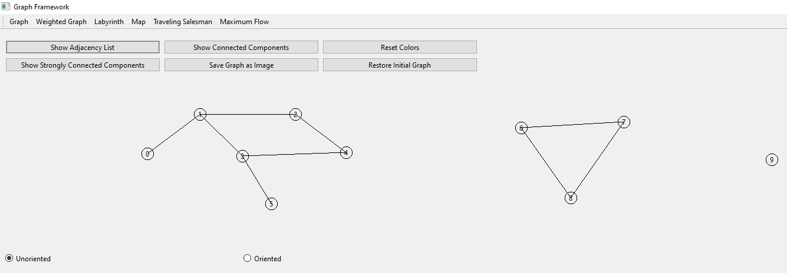

#### Directed Graph

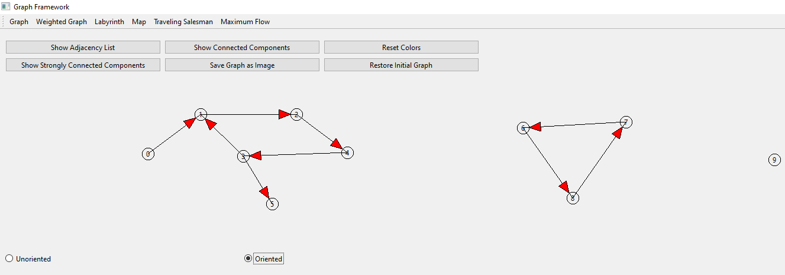

#### Adjacency List

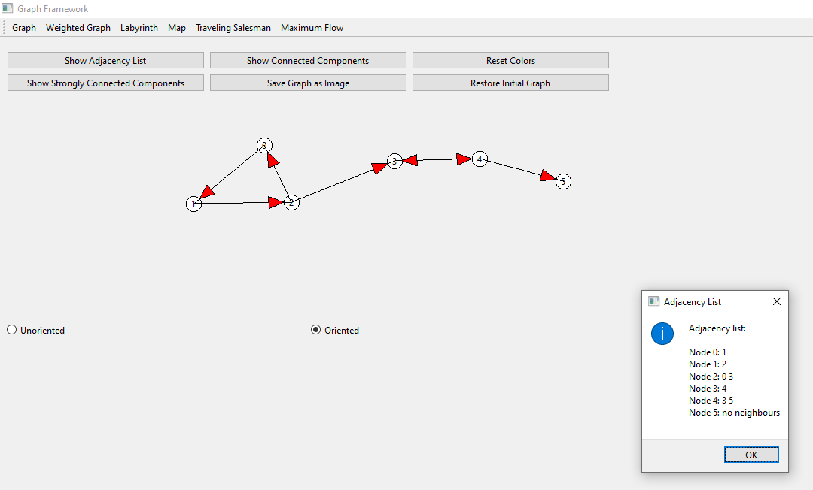

#### Graph Validation and Interaction

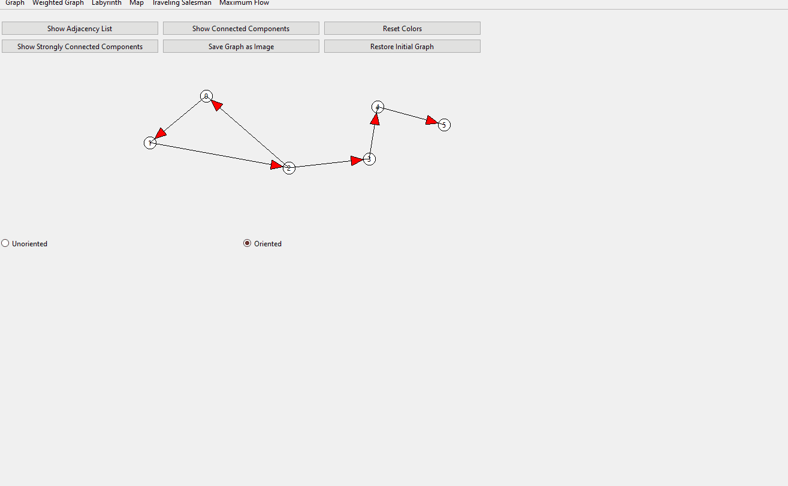

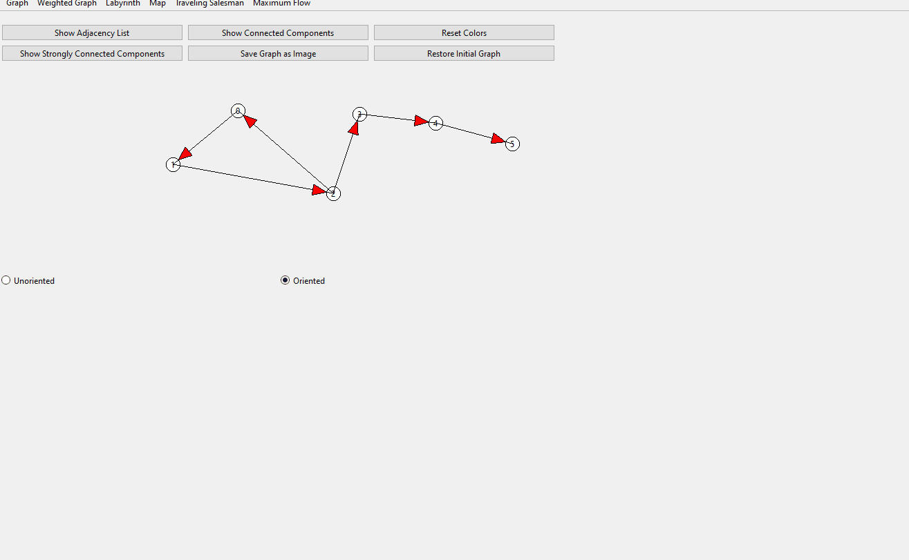

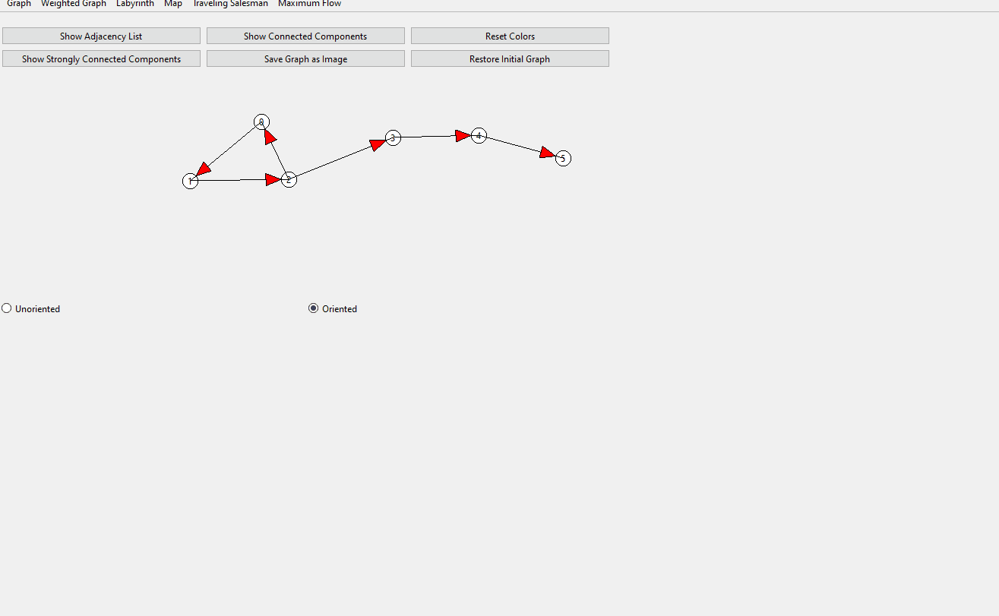

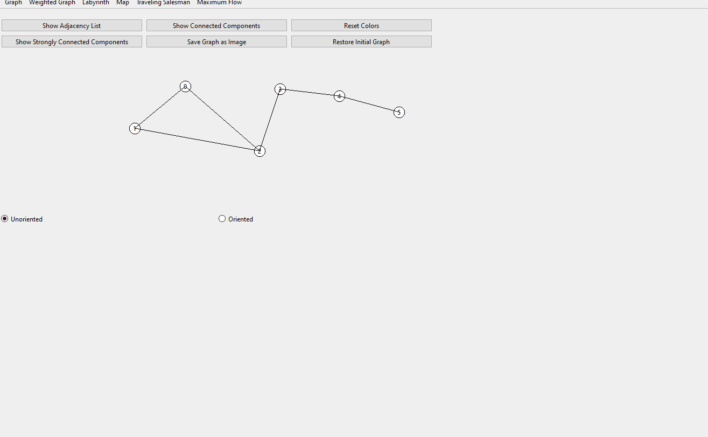


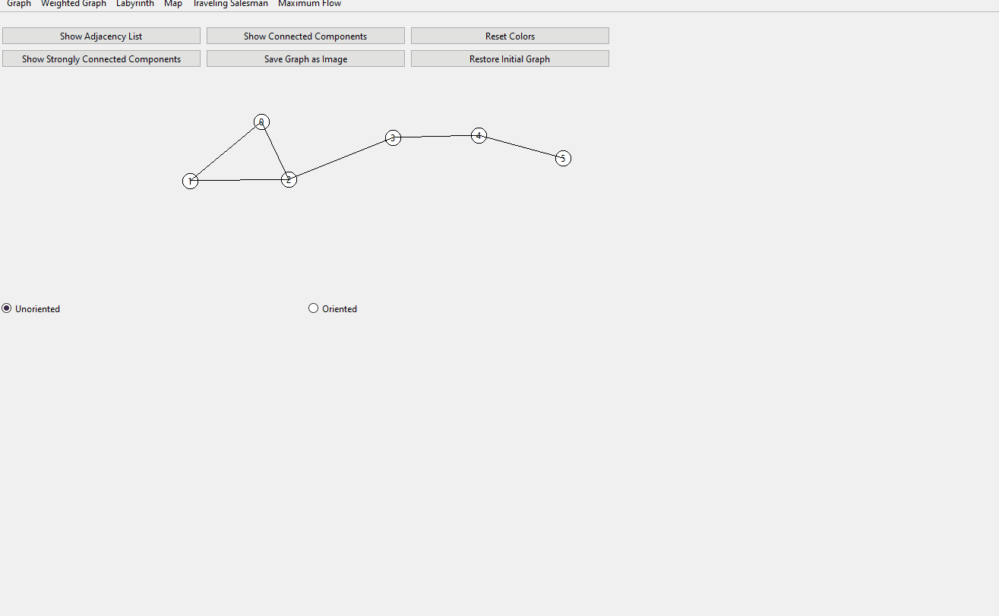

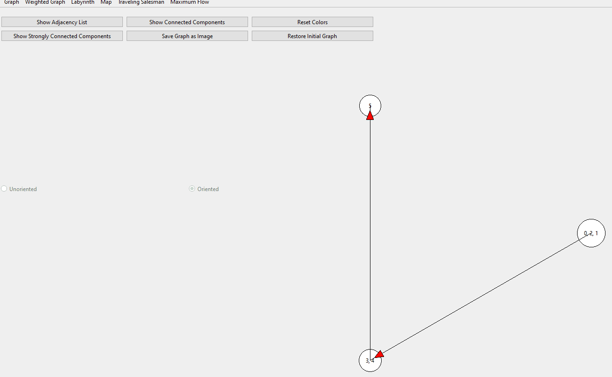

---

### 2. Labyrinth and Breadth-First Search

The second assignment focused on representing a labyrinth as a graph and using **Breadth-First Search (BFS)** to determine paths from the entrance to the available exits.

#### Labyrinth Input


#### Graph Construction

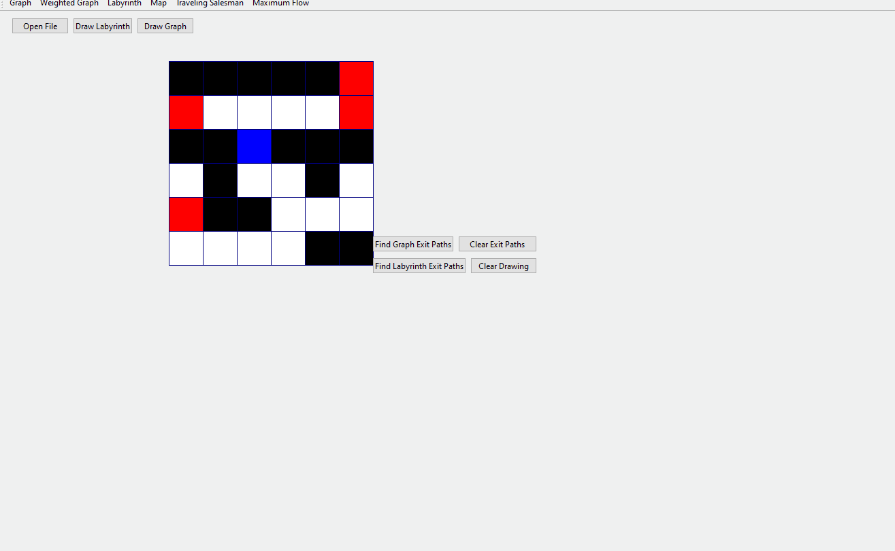

#### Exit Paths

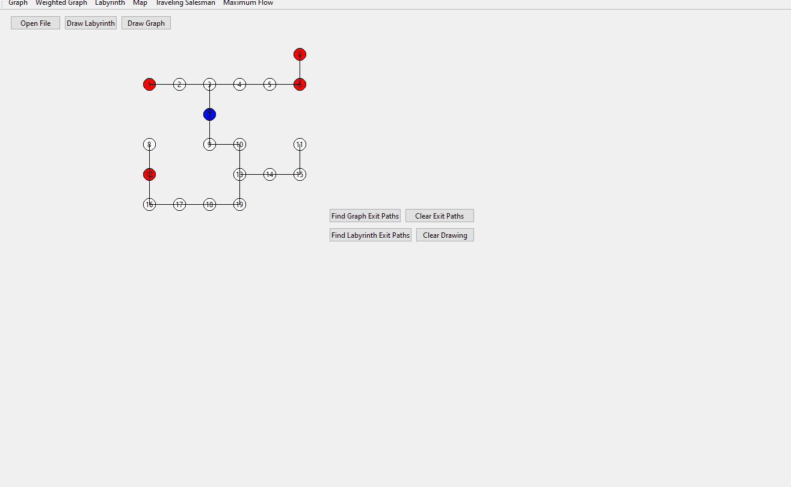


#### Clearing Exit Paths

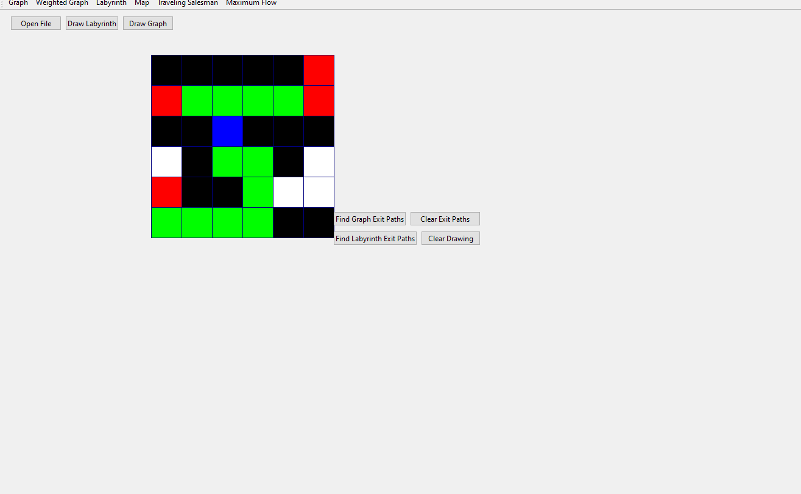

---

### 3. Topological Sorting and Shortest Paths

The third assignment introduced weighted directed graphs, non-recursive DFS, topological sorting, cycle detection, and shortest paths in directed acyclic graphs.

#### Weighted Graph


#### Add Edge Weight


#### Shortest Paths


#### Topological Sorting


#### Cycle Detection


---

### 4. Connected and Strongly Connected Components

The fourth assignment focused on graph connectivity and strongly connected components.

The connected-components algorithm assigns a different color to each connected component of an undirected graph, while the strongly connected components algorithm produces a condensed directed graph representing the relationships between the resulting components.

#### Connected Components

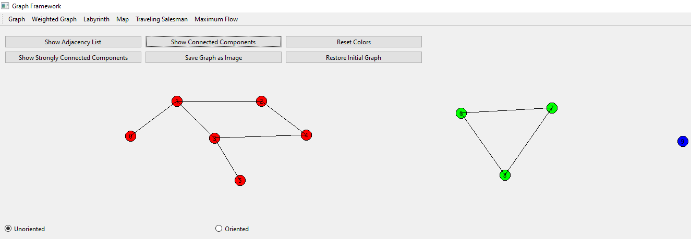

#### Strongly Connected Components

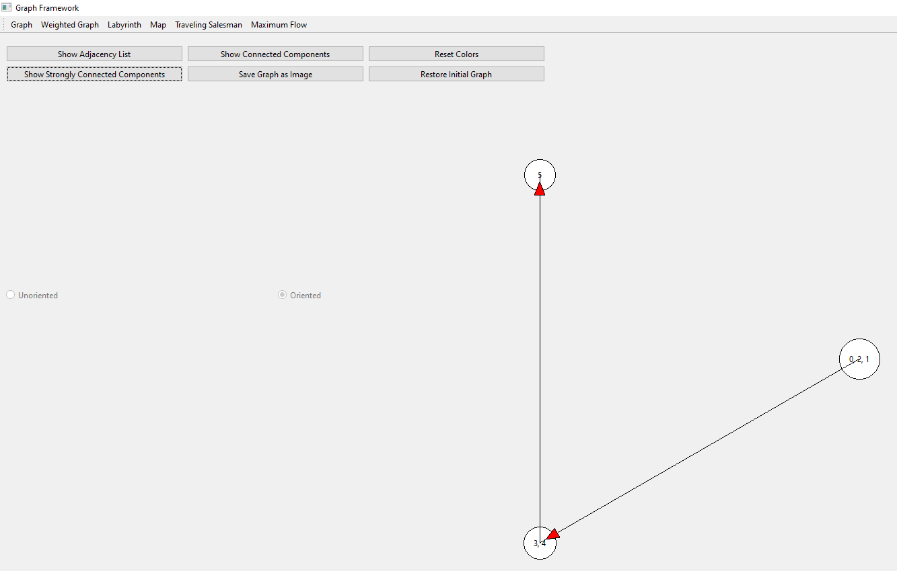

---

### 5. Geographic Map and Dijkstra

The fifth assignment introduced geographic map processing and **Dijkstra's shortest-path algorithm**.

The application loads geographic data, renders the map according to the coordinates of the nodes, supports zooming and panning, and allows the user to select two locations. A **KD-Tree** is used to efficiently find the graph nodes nearest to the selected points.

#### Map Loading

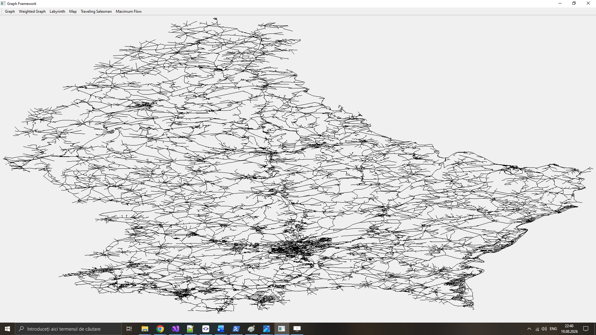

#### Zoom and Map Navigation

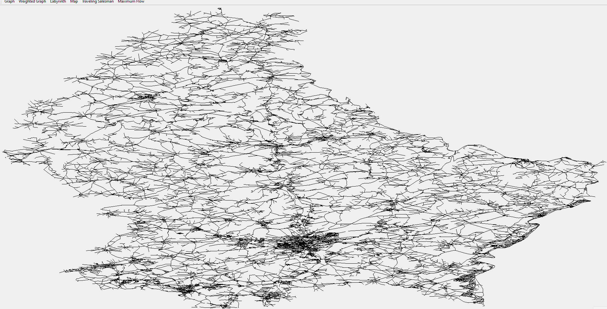

#### Selecting Two Points and Finding the Shortest Path

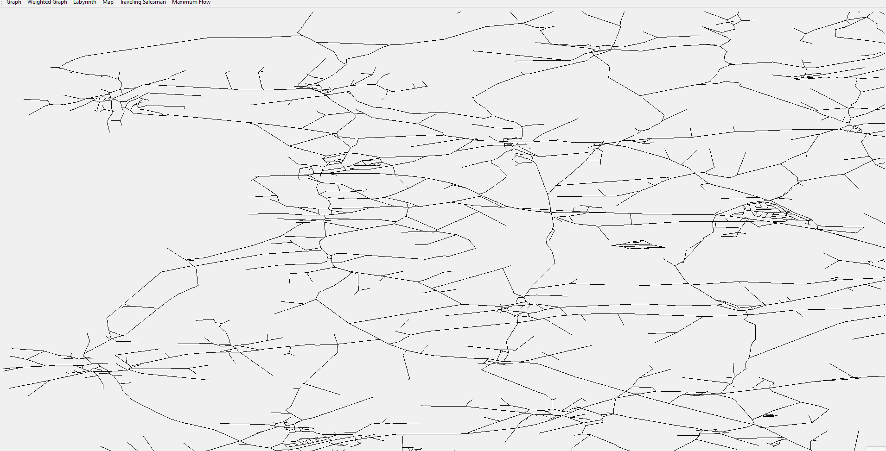

#### No Path Between Selected Nodes

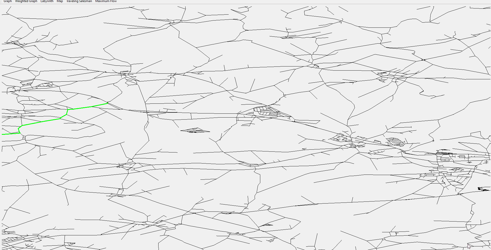

---

### 6. Traveling Salesman Problem

The sixth assignment focused on an approximate solution to the **Traveling Salesman Problem (TSP)**.

The application loads the city data, generates the complete graph using minimum distances obtained with **Floyd–Warshall**, computes a **Minimum Spanning Tree** using **Kruskal and Union-Find**, and generates an approximate TSP circuit through preorder traversal of the tree.

#### Initial Graph


#### Show Initial Graph


#### Complete Graph


#### Minimum Spanning Tree


#### Approximate TSP Circuit


---

### 7. Maximum Flow and Minimum Cut

The seventh assignment introduced network flow algorithms through the implementation of **Ford–Fulkerson** for maximum flow and minimum cut identification.

The interface allows capacities to be assigned to network edges, a source and target to be selected, and the maximum-flow algorithm to be executed. The residual network can be visualized during the algorithm, while the final minimum-cut edges are highlighted separately.

#### Adding Edge Capacities


#### Residual Network


#### Maximum Flow and Minimum Cut


## 📋 Requirements

- Windows 10 / Windows 11
- Qt 6.11.1
- MSVC 2022
- Windows 10.0 SDK
- C++14 (ISO C++14)
- 64-bit build environment

> Developed and tested using Visual Studio 2026 with the MSVC 2022 toolset, Qt 6.11.1, and the Windows 10.0 SDK.

## 🚀 Running

1. Clone the repository.

```bash
git clone <repository-url>
```

2. Open `GraphFramework.slnx` in `Visual Studio 2026`.

3. Make sure the project is configured with:

- `MSVC 2022`
- `C++14 (ISO C++14)`
- `64-bit`
- `Qt 6.11.1`
- `Windows 10.0 SDK`

4. Build the solution.

```text
Build → Build Solution
```

or simply press:

```text
Ctrl + Shift + B
```

5. Run the application.

```text
F5
```

or click **Start** in Visual Studio.

The application starts on the `Graph` page. The available modules can be accessed from the application menu:

- Graph
- Weighted Graph
- Labyrinth
- Map
- Traveling Salesman
- Maximum Flow

### Graph

The **Graph** page allows the user to construct a graph interactively using the mouse.

- **Right-click** to add nodes.
- **Left-click** two nodes to create an edge.
- The graph can be configured as **directed** or **undirected**.
- Nodes can be repositioned using the **middle mouse button**.
- Graph validation and graph algorithms can be executed through the available controls.
- **Connected Components** and **Strongly Connected Components** can be displayed.
- The **Adjacency List** can be displayed.
- The graph can be **saved as an image**.

### Weighted Graph

The **Weighted Graph** page is used for algorithms on weighted directed graphs.

- Add nodes using the mouse.
- Connect nodes to create edges.
- Assign costs to the edges.
- Use the available controls to:
  - Display edge weights.
  - Compute shortest paths using the topological-order approach.
  - Display the topological ordering.

The shortest-path operation asks the user to select a source node and then displays the shortest path to every other node. The topological sorting operation also verifies whether the graph contains a cycle before executing the algorithm.

### Labyrinth

The **Labyrinth** page allows a labyrinth input file to be selected using the file dialog.

- Select a `.txt` labyrinth file.
- Choose either:
  - **Draw Labyrinth** to display the original labyrinth.
  - **Draw Graph** to transform the walkable cells into a graph.
- Use the path-finding functionality to run **BFS** and determine the paths to the exits.
- The identified exit paths are highlighted in **green**.
- The paths can be cleared using the corresponding reset control.

The application reconstructs the labyrinth graph, runs **Breadth-First Search**, finds the path to every exit, and marks the resulting paths.

### Map

The **Map** page automatically loads the `Luxembourg_Map.xml` dataset when the application starts.

- Select a starting point by clicking on the map.
- Select a destination point by clicking again.
- The application finds the nearest graph node for each click using the **KD-Tree**.
- **Dijkstra's algorithm** is executed between the selected nodes.
- The shortest path is displayed in **green**.
- **Right-click and drag** to pan the map.
- Use the **mouse wheel** to zoom.

The map and its KD-Tree are initialized during application startup from `Data/Luxembourg_Map.xml`. The two selected points are then connected using Dijkstra's shortest-path computation.

### Traveling Salesman Problem

The **Traveling Salesman** page loads the city data automatically from:

```text
Data/input.txt
```

The page provides several visualization and algorithm controls:

- **Show Initial Graph**
  - Displays the original graph and its city-to-city distances.

- **Show Complete Graph**
  - Runs **Floyd–Warshall**.
  - Generates the complete graph using the resulting minimum distances.

- **Show Minimum Spanning Tree**
  - Runs **Floyd–Warshall**.
  - Generates the complete graph.
  - Computes the MST using **Kruskal's algorithm**.
  - Displays the MST step by step.

- **Show TSP Circuit**
  - Runs **Floyd–Warshall**.
  - Generates the complete graph.
  - Computes the MST using **Kruskal's algorithm**.
  - Generates the approximate TSP circuit through **preorder traversal**.
  - Displays the circuit step by step and reports the total distance.

The initial graph, complete graph, MST, and approximate TSP circuit are controlled independently by the corresponding interface actions.

### Maximum Flow

The **Maximum Flow** page is used to construct a flow network and execute the **Ford–Fulkerson** algorithm.

- Right-click to add nodes.
- Left-click two nodes to create a directed flow edge.
- Enter the capacity of the edge when prompted.
- Use **Select Source** and click a node.
- Use **Select Target** and click a node.
- Press **Run Maximum Flow** to execute Ford–Fulkerson.
- The current flow and maximum flow are displayed during the execution.
- The minimum cut is generated automatically after the algorithm finishes.
- Minimum-cut edges are highlighted in **orange**.
- Press **Reset Network** to reset the algorithm state and run the algorithm again with a new source and target.

The maximum-flow operation executes Ford–Fulkerson and then automatically generates and highlights the minimum cut.

For step-by-step Ford–Fulkerson execution, press **Enter** after selecting the source and target. Each iteration displays the current flow, while the final step generates the minimum cut.

The application expects the required input files to remain in the `Data` directory. The TSP graph is loaded from `Data/input.txt`, while the map is loaded from `Data/Luxembourg_Map.xml`.

## 📄 License

This project is released under the **MIT License**.

See the [LICENSE](LICENSE) file for more details.
